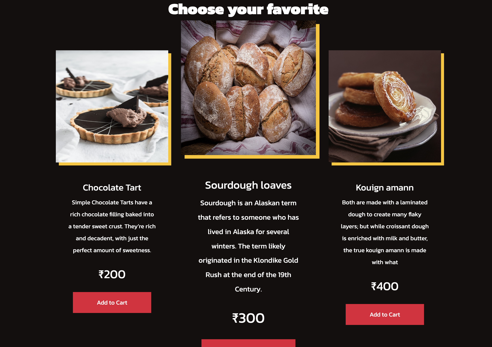

<h1>:bakery: Parjanay's Bakery</h1>

*Ecommerce template built using React and styled-components*

:gem: **Features:**
- Mobile-responsive
- Slide-out menu
- Grid layout for display products

To run the project:
 - `npm init` to initialize the application
 - `npm install` to install the dependencies
 - `npm start` to start the application
<h1>The screenshot of the website looks like this</h1>
 
<h2>The items are displayed as shows</h2>
